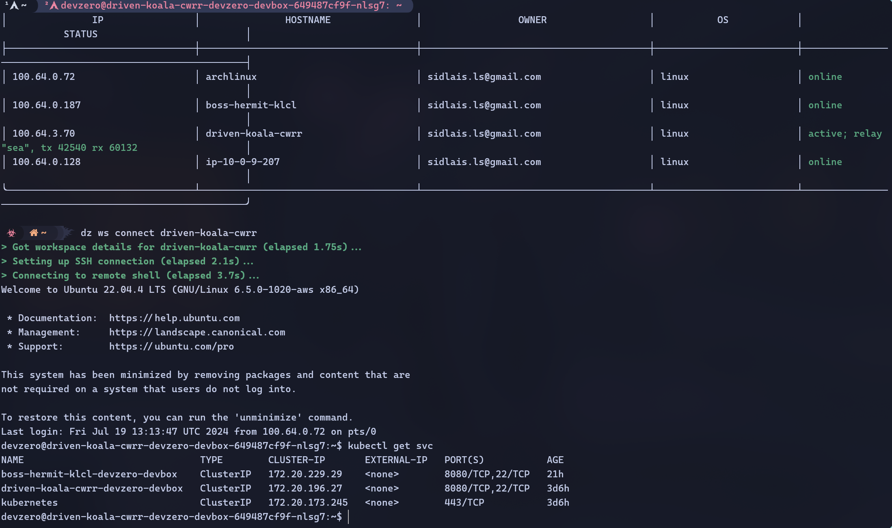

Connecting to EKS running in the private subnet of AWS VPC from your DevBox.

## Architecture Diagram


## Prerequisites

- Follow [Connecting to AWS](../../existing-network/connecting-to-aws.md) guide.

## Existing EKS

### Step 1: Accessing EKS from a DevBox

1. Go to **Amazon Elastic Kubernetes Service > Clusters**.
2. Go to your **DevBox** and install awscli:

```
sudo apt install awscli
```

3. Download the **kubectl** binaries:

```
curl -LO "https://dl.k8s.io/release/$(curl -L -s https://dl.k8s.io/release/stable.txt)/bin/linux/amd64/kubectl"
```

4. Install **kubectl**:

```
sudo install -o root -g root -m 0755 kubectl /usr/local/bin/kubectl
```

5. Check if the cluster is accessible:

```
kubectl get svc
```



## New EKS Cluster

### Step 1: Creating a EKS Cluster

1. Go to **Amazon Elastic Kubernetes Service > Clusters > Add cluster > Create**.
2. Enter the name of the cluster and assign a **Cluster service role** which has **AmazonEKSClusterPolicy** permission. If no role is present, create a new one with the same permission.
3. Click on **Next**. In the **Networking** section, choose the VPC where your bastion host is deployed and assign 2 private subnets. In **Cluster endpoint access**, select **Private**.
4. Configure other configurations as required and then create the cluster. After creating the cluster, go to the **compute** section and under **Node groups** click on **Add node group**.
5. Enter the name of the node group and assign a node IAM role with **AmazonEC2ContainerRegistryReadOnly**, **AmazonEKS_CNI_Policy** and **AmazonEKSWorkerNodePolicy** permissions. If no role is present, create a new one with the same permissions.
6. Configure other configurations as required and create the nodes.


### Step 2: Installing the necessary tools

1. Go to your **DevBox** and install awscli:

```
sudo apt install awscli
```

2. Download **kubectl** binaries:

```
curl -LO "https://dl.k8s.io/release/$(curl -L -s https://dl.k8s.io/release/stable.txt)/bin/linux/amd64/kubectl"
```

3. Install **kubectl**:

```
sudo install -o root -g root -m 0755 kubectl /usr/local/bin/kubectl
```

### Step 3: Accessing the EKS Cluster

1. Click on your AWS username at the top right corner and go to **Security credentials**. In the **Access keys** section, click on **Create access key**. Create the key and save the **CSV** file.
2. In your **DevBox**, use the csv credentials to configure the awscli to your account:

```
aws configure
```

3. Check if the cluster is accessible:

```
kubectl get svc


