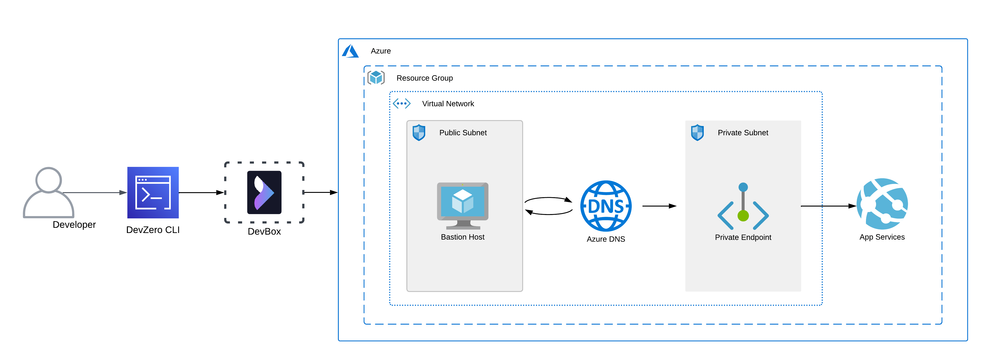
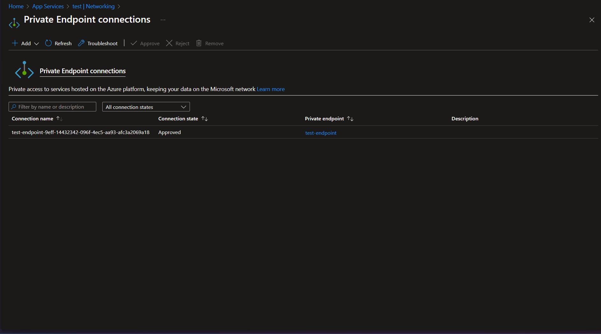

You are connecting to an App Service running on your Azure infrastructure from your DevBox.

## Architecture Diagram



[Azure App Service](https://azure.microsoft.com/en-us/products/app-service) enables you to build and host web apps, mobile backends, and RESTful APIs in the programming language of your choice without managing infrastructure. This connection between the app service and workspace would occur by setting up a bastion host that advertises the private routes to your DevZero network so you can access the private service through network tunneling. You must also set up a DNS Private Resolver to access the App Service's Private Endpoint from your DevBox.

## Prerequisites

1. Before you begin, follow the [Connecting to Azure](../../existing-network/connecting-to-azure.md) guide to set up the Bastion Host to access your private Azure services.
2. Following the above criteria, follow the [Setting up DNS Private Resolver](./setting-up-dns-private-resolver.md) guide to access the DNS Private Zones.

## Existing Azure App Services

To connect to an App Service running in the private subnet, please ensure it is within the same **Resource Group** and **VNET** containing the Bastion Host.

### Step 1: Creating a Workspace from the Recipe

It would be best if you created a workspace so you can access the app service:

1. Go to [DevZero Dashboard](https://www.devzero.io/dashboard).
2. Navigate to the **Workspaces** tab and click on **New workspace**.
3. Enter the workspace name and click on **Select from recipe library**.
4. Click on **New Recipe** and enter the recipe name and click on **Create a recipe**.
5. Select a workspace region and click on **Launch**.

### Step 2: Creating a Private Endpoint

1. Navigate to **Networking** and open **Private Endpoints** page.
2. Click on **Add > Express** and then enter the name of your private endpoint.
3. Then select the VNET and a compatible subnet. Turn on the **Integrate with private DNS zone** option.
4. Click on **Ok**, and your private connection to your web app will be successfully deployed.



### Step 3: Accessing App Service from DevBox

Follow the Below steps to access your Web App from your DevBox :

1. Connect to the workspace using the following command:

```
sudo dz workspace connect <workspace-name>
```

2. Copy the **Default domain** of the **App Service** you want to access.
3. Connect to the **App Service**:

```
curl -X GET <default-domain>
```


## New Azure App Service




If you need to make a new App Service running in a private subnet and access it through DevZero's network, then follow the below steps:

### Step 1: Creating a Web App Service

1. Go to **Home > App Services** and click on **Create > Web App**.
2. In the **Basics** section, select the resource group you previously selected for your VNET.
3. Enter the **Name** of the web app, choose the **Publishing Model** between **Code**, **Container**.




4. Select your **Runtime Stack**, **Operating System**, **Region** and then configure your **Pricing Plans** accordingly.
5. On the **Container** page, select your desired Image source from Quickstart images, Azure Container Registry, or Another registry.
6. For this guide, we will be working with Quickstart images. Then select or input the Image for your container.
7. In the **Networking** section, choose the **off** option under the **Enable public access** section.
8. Click on **Review + Create** and then click on **Create**.
9. After deploying the app, open your created service and navigate to **Deployment > Deployment Center**.
10. Select a **Code Source** and then enter the **Organisation**, **Repository**, and **branch** name. After you are done with your configuration, click on **Save**.
11. Navigate to **Networking** and open **Private Endpoints** page.
12. Click on **Add > Express** and then enter the name of your private endpoint.
13. Then select the VNET and a compatible subnet. Turn on the **Integrate with private DNS zone** option.
14. Click on **Ok**, and your private connection for your web app will be successfully deployed.





4. Select your **Operating System**, **Region** and then configure your **Pricing Plans** accordingly.
5. On the Deployment page, choose whether you want to enable Continuous deployment. If enabled, Enter your GitHub Repository details for your source code, such as the Organization, Repository, and Branch names.
6. In the **Networking** section, choose the **off** option under the **Enable public access** section.
7. Click on **Review + Create** and then click on **Create**.
8. After creating the web app, navigate to Networking and open the Private Endpoints page.
9. Click on **Add > Express** and then enter the name of your private endpoint.
10. Then select the VNET and a compatible subnet. Turn on the **Integrate with private DNS zone** option.
11. Click on **Ok**, and your private connection for your web app will be successfully deployed.








If you need to make a new static web App Service, then follow the below steps:

### Step 1: Creating a Static Web App Service

1. Go to **Home > App Services** and click on **Create > Static Web App**.
2. In the **Basics** section, select the resource group you previously selected for your VNET.
3. Enter the **Web App** name, and **Hosting plan**.
4. After this, choose the **Source Model** between **GitHub**, **Azure Devops** or **Other**.




5. Enter the **Organisation**, **Repository**, and **branch** name.
6. Click on **Review + Create** and click on **Create**.
7. Navigate to **Networking** and open **Private Endpoints** page.
8. Click on **Add > Express** and then enter the name of your private endpoint.
9. Then select the VNET and a compatible subnet. Turn on the **Integrate with private DNS zone** option.
10. Click on **Ok**, and your private connection for your web app will be successfully deployed.





5. Enter the **Organisation**, **Project**, **Repository**, and **branch** name.
6. Click on **Review + Create** and click on **Create**.
7. Navigate to **Networking** and open **Private Endpoints** page.
8. Click on **Add > Express** and then enter the name of your private endpoint.
9. Then select the VNET and a compatible subnet. Turn on the **Integrate with private DNS zone** option.
10. Click on **Ok**, and your private connection for your web app will be successfully deployed.








If you need to make a new App Service with database integration, then follow the below steps:

### Step 1: Creating a Web App + Database Service

1. Go to **Home > App Services** and click on **Create > Web App + Database**.
2. In the **Basics** section, select the resource group you previously selected for your VNET.
3. Enter the **Web App** name, and **Runtime** stack.
4. After this, select the database **Engine**, **Server name**, and **Database name**.
5. If you want to, select the Azure Cache for Redis option and choose your Hosting plan.
6. Click on **Review + Create** and click on **Create**.
7. After deploying the app, open your created service and navigate to **Deployment > Deployment Center**.
8. Select a **Code Source** and then enter the **Organisation**, **Repository**, and **branch** name. After you are done with your configuration, click on **Save**.
9. Navigate to **Networking** and open **Private Endpoints** page.
10. Click on **Add > Express** and then enter the name of your private endpoint.
11. Then select the VNET and a compatible subnet. Turn on the **Integrate with private DNS zone** option.
12. Click on **Ok**, and your private connection for your web app will be successfully deployed.




### Step 2: Creating a Workspace

It would be best if you created a workspace so you can access the app service:

1. Go to [DevZero Dashboard](https://www.devzero.io/dashboard).
2. Navigate to the **Workspaces** tab and click on **New workspace**.
3. Enter the workspace name and click on **Select from recipe library**.
4. Click on **New Recipe** and enter the recipe name and click on **Create a recipe**.
5. Select a workspace region and click on **Launch**.

### Step 3: Accessing App Service from DevBox

Follow the Below steps to access your Web App from your DevBox :

1. Connect to the workspace using the following command:

```
sudo dz workspace connect <workspace-name>
```

2. Copy the **Default domain** of the **App Service** you want to access.
3. Connect to the **App Service**:

```
curl -X GET <default-domain>
```


