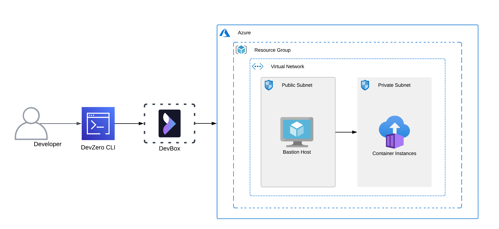
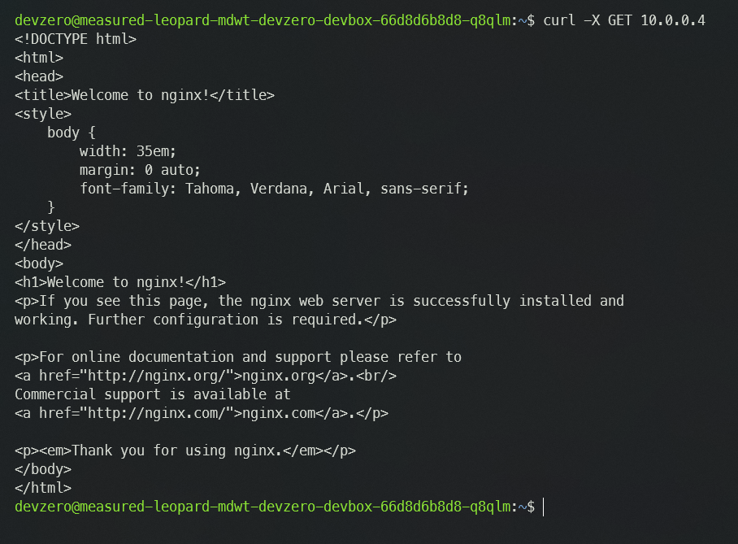

# Azure Container Instance

You are connecting to a Container Instance running in the private subnet of Azure Virtual Network (VNET) from your DevBox.

## Architecture Diagram



This would take place by setting up a bastion host that advertises the VNET CIDR to your DevZero network so that you can access the private service through the network tunneling.

## Prerequisites

Before you begin, follow the [Connecting to Azure](../../existing-network/connecting-to-azure.md) guide to set up the Bastion Host to access your private Azure services.





## New Azure Container Instance

If you need to make a new container running in a private subnet and access it through DevZero's network, then follow the below steps:

### Step 1: Creating a Container Instance

1. Go to **Home > Container Instances** and click on **Create**.
2. In the **Basics** section, select the **Resource group** you previously selected for your VNET.
3. Then input your **Container name** and **Region** and choose your desired **SKU**.
4. Choose your desired **Image source** between `Quickstart images`, `Azure Container Registry`, and `Other registry`.
5. For this guide, we will be working with `Quickstart images`.
6. Select or input the **Image** and choose the desired size configuration for your container.
7. In the Networking page, choose the **Private** option, select your VNET and desired subnet.
7. Click on **Review + Create** and click on **Create** to create container.

### Step 2: Accessing container from DevBox

1. Go to **DevBox**.
2. You can access the contents of the container using the `curl` command:


```
curl -X GET <private-ip>
```



