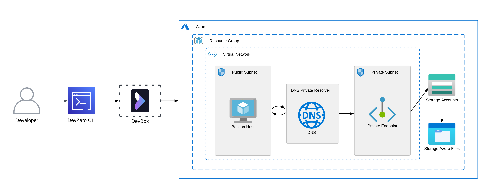
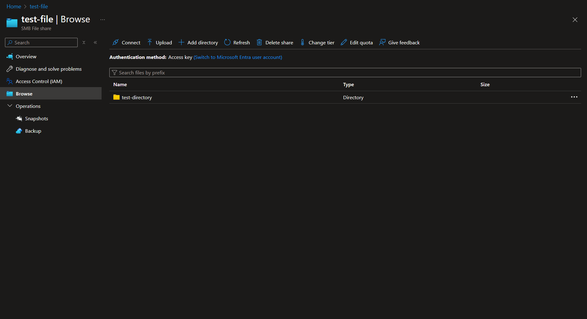

# Azure File Storage

Connecting to an Azure File Storage from your DevBox.

## Architecture Diagram



[Azure File Storage](https://learn.microsoft.com/en-us/azure/storage/files/storage-files-introduction) is a fully managed file shares in the cloud that are accessible via the industry standard Server Message Block (SMB) protocol, Network File System (NFS) protocol, and Azure Files REST API. Azure file shares can be mounted concurrently by cloud or on-premises deployments. SMB Azure file shares are accessible from Windows, Linux, and macOS clients.

This connection between the Azure File Share and your DevBox would take place by setting up a bastion host that advertises the private routes to your DevZero network so that you can access the private service through network tunneling. You must also set up a DNS Private Resolver to access the File Storage's Private Endpoint from your DevBox.

## Prerequisites

1. Before you begin, follow the [Connecting to Azure](../../existing-network/connecting-to-azure.md) guide to set up the Bastion Host to access your private Azure services.
2. Following the above criteria, follow the [Setting up DNS Private Resolver](./setting-up-dns-private-resolver.md) guide to access the DNS Private Zones.
3. After successfully setting up the DNS Private Resolver, follow the [Configuring Storage Account](./configuring-storage-account.md) guide to access the storage account endpoint.

## Existing Azure File Storage

To connect to a Storage Account, ensure it is within the same **Resource Group** containing the Bastion Host.

### Step 1: Creating a Recipe

First we need to create a recipe for the workspace:

1. Go to the [DevZero Dashboard > Recipes](https://www.devzero.io/dashboard/recipes) and click on **New recipe**.
2. Enter the recipe name and click on **Create a recipe**.
3. Now use the below provided snippet to create a recipe for your workspace:


```
version: "3"

build:
  steps:
    - type: apt-get
      packages: ["build-essential", "curl", "git", "nano", "software-properties-common", "ssh", "sudo", "tar", "unzip", "vim", "wget", "zip", "postgresql-client"]
    - type: command
      command: |
        sudo curl -sL https://aka.ms/InstallAzureCLIDeb | sudo bash
```


4. Click on **Save and Build** and when the build is successful, click on **Publish**.

### Step 2: Creating a Workspace

1. Go to the [Devzero Dashboard > Workspaces](https://www.devzero.io/dashboard/workspaces) and click on **New workspace**.
2. Enter the workspace name and click on **Select from recipe library**.
3. Select the recipe you just created and click on **Select**.
4. Click on **Launch** and your workspace will be ready in a few minutes.

### Step 3: Accessing the File Storage

Now follow the below steps to access the File Storage on your DevBox:

1. Connect to DevBox and login into your Azure account using the `login` command:


```
az login
```


2. After you have completed your authentication, go to **Home > Storage Accounts** and select your storage account.
4. Then go to the **Security + Networking > Access Keys** section and note down either of the two access keys presented to you.
5. After you have acquired the access key, you may use the following command to Upload, Download, or list the files in the file share:




To Upload a file as File to the file share, use the following command:


```
az storage file upload \
    --account-name <storage-account> \
    --account-key <access-key> \
    --share-name <file-share-name> \
    --source "file-name.txt" \
    --path "<directory-name>/<file-name>.txt"
```


Here `--source` tag refers to the file you want to upload and `--path` tag refers to where you want to upload the file by specifying a directory and output file name.






To Download a file from the file share, use the following command:


```
az storage file upload \
    --account-name <storage-account> \
    --account-key <access-key> \
    --share-name <file-share-name> \
    --path "<directory-name>/<file-name>.txt" \
    --dest "<file-name>.txt" \
    --output none
```


Here `--path` tag refers to terminal path of the file you want to download from your file share and `--dest` tag refers to how and where you want to save your file by specifying a directory and output file name.






To list all the files in the file share, use the following command:


```
az storage file list \
    --account-name <storage-account> \
    --account-key <access-key> \
    --share-name <file-share-name> \
    --path "<directory-name>" \
    --output table
```







## New File Storage

If you need to make a new File Storage and access it through DevBox, then follow the below steps:

### Step 1: Creating a File Storage

Firstly, you must follow the [Configuring Storage Account](./configuring-storage-account.md) guide to create and configure a new storage account. After the setup, you must also set up the DNS Private Resolver by following the [Setting up DNS Private Resolver](./setting-up-dns-private-resolver.md) guide.

After the above mentioned steps are completed, you may go ahead and create a file share for File Storage by following these steps:

1. Go to **Home > Storage Accounts** and click on your storage account.
2. Go to the **Data Storage** tab and click on **File Shares**.
3. Create a new File Share by entering the file share name and clicking on **Create**.
4. After creating the file share, go to the **Security + Networking > Access Keys** section and note down either access key.

### Step 2: Creating a Recipe

First we need to create a recipe for the workspace:

1. Go to the [DevZero Dashboard > Recipes](https://www.devzero.io/dashboard/recipes) and click on **New recipe**.
2. Enter the recipe name and click on **Create a recipe**.
3. Now use the below provided snippet to create a recipe for your workspace:


```
version: "3"

build:
  steps:
    - type: apt-get
      packages: ["build-essential", "curl", "git", "nano", "software-properties-common", "ssh", "sudo", "tar", "unzip", "vim", "wget", "zip", "postgresql-client"]
    - type: command
      command: |
        sudo curl -sL https://aka.ms/InstallAzureCLIDeb | sudo bash
```


4. Click on **Save and Build** and when the build is successful, click on **Publish**.

### Step 3: Creating a Workspace

1. Go to the [Devzero Dashboard > Workspaces](https://www.devzero.io/dashboard/workspaces) and click on **New workspace**.
2. Enter the workspace name and click on **Select from recipe library**.
3. Select the recipe you just created and click on **Select**.
4. Click on **Launch** and your workspace will be ready in a few minutes.

### Step 4: Accessing the File Storage

After creating the File Share, you must install and authenticate your Azure CLI to easily access File Storage. To do so, you may follow the below steps:

1. Connect to your DevBox and login into your Azure account using the `login` command:


```
az login
```


2. Use the following command to create a directory in the File Share:


```
az storage directory create \
   --account-name <storage-account> \
   --account-key <access-key> \
   --share-name <file-share-name> \
   --name <directory-name> \
   --output none
```




3. You may use the following command to Upload, Download, or list the File in the File Share:




To Upload a file as File to the file share, use the following command:


```
az storage file upload \
    --account-name <storage-account> \
    --account-key <access-key> \
    --share-name <file-share-name> \
    --source "file-name.txt" \
    --path "<directory-name>/<file-name>.txt"
```


Here `--source` tag refers to the file you want to upload and `--path` tag refers to where you want to upload the file by specifying a directory and output file name.






To Download a file from the file share, use the following command:


```
az storage file upload \
    --account-name <storage-account> \
    --account-key <access-key> \
    --share-name <file-share-name> \
    --path "<directory-name>/<file-name>.txt" \
    --dest "<file-name>.txt" \
    --output none
```


Here `--path` tag refers to terminal path of the file you want to download from your file share and `--dest` tag refers to how and where you want to save your file by specifying a directory and output file name.






To list all the files in the file share, use the following command:


```
az storage file list \
    --account-name <storage-account> \
    --account-key <access-key> \
    --share-name <file-share-name> \
    --path "<directory-name>" \
    --output table
```





