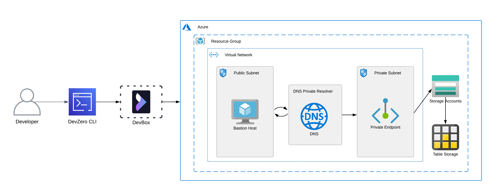

# Azure Table Storage

Connecting to a Table Storage from your DevBox.

## Architecture Diagram



Here, you will connect to a Table Storage from your DevBox. This would be done by setting up a bastion host that advertises the private routes to your DevZero network so that you can access the private service through network tunneling. You must also set up a DNS Private Resolver to access the Table Storage's Private Endpoint from your DevBox.

## Prerequisites

Before you begin, follow the [Connecting to Azure](../../existing-network/connecting-to-azure.md) guide to set up the Bastion Host to access your private Azure services.

## Existing Azure Table Storage

To connect to a Storage Account, ensure it is within the same **Resource Group** containing the Bastion Host.

Following the above criteria, follow the [Setting up DNS Private Resolver](./setting-up-dns-private-resolver.md) guide to access the DNS Private Zones.

After successfully setting up the DNS Private Resolver, follow the [Connecting to Storage Account](./connecting-to-storage-account.md) guide to configure the storage account.

Now follow the below steps to access the Table Storage on your DevBox:

1. Go to DevBox and install the Azure CLI tool using the following command:


```bash
sudo curl -sL https://aka.ms/InstallAzureCLIDeb | sudo bash
```


2. Login into your Azure account using the `login` command:


```bash
az login
```


3. After you have completed your authentication, go to **Home > Storage Accounts** and select your storage account.
4. Then go to the Security + Networking > Access Keys section and note down either of the two access keys presented to you.
5. After you have acquired the access key, you may use the following command to Upload, Download, or list the Table in the container:




To Upload a file to the Table to the container, use the following command:


```bash
az storage blob upload \
    --account-name <storage-account> \
    --account-key <access-key> \
    --container-name <container> \
    --name myTable.txt \
    --file myTable.txt \
```







To Download a file from the container, use the following command:


```bash
az storage blob download \
    --account-name <storage-account> \
    --account-key <access-key> \
    --container-name <container> \
    --name myTable.txt \
    --file myTable.txt \
```







To list all the blobs in the container, use the following command:


```bash
az storage blob list \
    --account-name <storage-account> \
    --account-key <access-key> \
    --container-name <container> \
    --output table
```






## New Table Storage

If you need to make a new Table Storage and access it through DevZero's network, then follow the below steps:

### Step 1: Creating a Storage Account

Firstly, you need to follow the [Connecting to Storage Account](./connecting-to-storage-account.md) guide to create a new storage account and configure it. After the setup is completed, you also need to set up the DNS Private Resolver by following the [Setting up DNS Private Resolver](./setting-up-dns-private-resolver.md) guide.

After the above mentioned steps are completed, you may go ahead and create a container for Table Storage by following these steps:

1. Go to **Home > Storage Accounts** and click on your storage account.
2. Go to the **Data Storage** tab and click on **Containers**.
3. Create a new container by entering the container name and clicking on **Create**.
4. After creating the container, go to the **Security + Networking > Access Keys** section and note down either access key.

### Step 2: Accessing the Table Storage

After creating the container, you must install and authenticate your Azure CLI to easily access Table Storage. To do so, you may follow the below steps:

1. Go to DevBox and install the Azure CLI tool using the following command:


```bash
sudo curl -sL https://aka.ms/InstallAzureCLIDeb | sudo bash
```


2. Login into your Azure account using the `login` command:


```bash
az login
```


3. You may use the following command to Upload, Download, or list the Table in the container.




To Upload a file as Table to the container, use the following command:


```bash
az storage blob upload \
    --account-name <storage-account> \
    --account-key <access-key> \
    --container-name <container> \
    --name myTable.txt \
    --file myTable.txt \
```







To Download a file from the container, use the following command:


```bash
az storage blob download \
    --account-name <storage-account> \
    --account-key <access-key> \
    --container-name <container> \
    --name myTable.txt \
    --file myTable.txt \
```







To list all the blobs in the container, use the following command:


```bash
az storage blob list \
    --account-name <storage-account> \
    --account-key <access-key> \
    --container-name <container> \
    --output table
```





