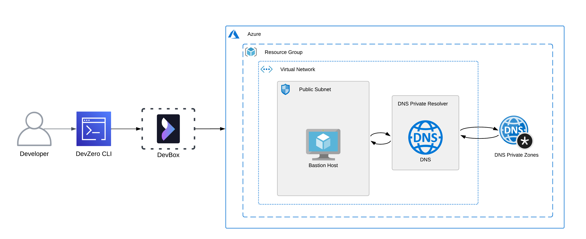
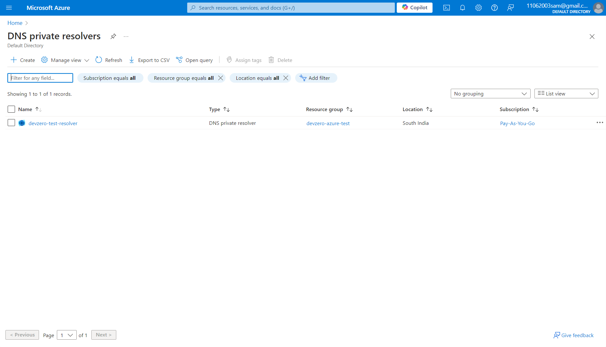
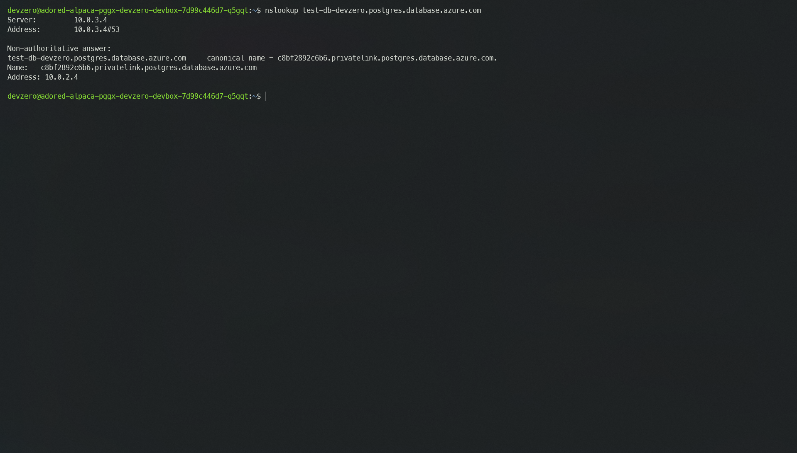

# Azure DNS Private Resolver

Setting up a DNS Private Resolver so that you can access the Azure Private DNS zones connected to your VNET.

## Architecture Diagram



Here, you will setup DNS Private Resolver through which you would resolve DNS queries from the DNS Private zones and direct them to the Bastion Host. The Bastion Host will then forward those queries to the DevZero Network through advertised routes.

## Prerequisites

Before you begin, follow the [Connecting to Azure](../../existing-network/connecting-to-azure.md) guide to set up the Bastion Host to access your private Azure services.

## Creating a DNS Private Resolver

To create a DNS Private Resolver, you need to ensure that you have no other DNS Private Resolver instances in your **Resource Group**.

If the above criteria are followed, then follow these steps:

1. Go to **Home > DNS Private Resolvers** and click on **Create**.
2. Enter Subscription and Resource Group name in the Project Details section.
3. Then enter the instance name and region. Remember to choose the region which houses your VNET.
4. Then select your Virtual Network (VNET).
5. In the **Inbound Endpoint** page, click on **Add an endpoint** and then enter the endpoint name.
6. While selecting the subnet for Inbound Endpoint, create a new subnet and then click on **Save**.
7. Click on **Review + Create** and click on **Create** to create the DNS Private Resolver.



## Setting up the Conditional Forwarder in DevBox

After you are done with creating the DNS Private Resolver, you need to add the DNS IP address to the DevZero Network so that you can use the Azure DNS Private Zones.

### Step 1: Creating a Virtual Machine

1. Go to **Home > DNS Private Resolver** and click on the new DNS Private Resolver you just created.
2. Then navigate to **Settings > Inbound Endpoints** and note down the IP Address of the inbound endpoint which you created.
3. Go to **DevBox** and enter the following command:


```bash
sudo nano /etc/resolv.conf
```


we need to add the IP address to this configuration file so that the DevZero Network can use the Conditional Forwarder.

4. Enter the following line to the `resolv.conf` file:


```bash
nameserver <ip-address>
```


save the file and you will now be able to access the domains within the Azure DNS Private Zones.

For Example, we have a DNS Private Zone named `privatelink.postgres.database.azure.com` and it houses a private domain endpoint named `test-db-devzero.postgres.database.azure.com`. You can verify the setup by using `nslookup`:


```bash
nslookup <private-domain-endpoint>
```


If everything goes well then you should see a output similar to this.


