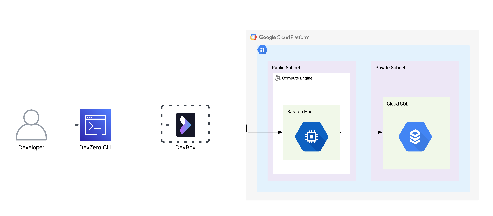

# Cloud SQL

Connecting to an Cloud SQL running in the private subnet of GCP VPC to your DevBox.

If you're more of a visual learner, check out the [video tutorial](#video-walkthrough)!

## Architecture Diagram



## Prerequisites

- Follow the [Connecting to GCP](../../existing-network/connecting-to-gcp.md) guide.

## Existing Database

### Step 1: Accessing Cloud SQL Instance from a DevBox

1. Go to **Cloud SQL > Instances** and note down the Internal IP Address of the instance.


2. Go to **VPC network > Routes** and select the region where you have deployed the instance.
3. Copy the **Destination IP Range** of the **Peering Subnet** route which contains the IP address of the Cloud SQL Instance.


4. SSH into your **Bastion Host** and enter the following command:


```
sudo dz net connect --ssh --advertise-routes=<Destionation-IP-Range>
```


5. Go to **DevBox**.
6. Connecting to the Database.

Run the following commands:



To install the mysql client cli:

```
sudo apt install mysql-client
```

To access the database:


```
mysql -h <Endpoint> -u <Username> --database <Database Name> -p
```




To install the psql client cli:

```
sudo apt install postgresql-client
```

To access the database:


```
psql -h <Endpoint> --username <Username> -d <Database Name> --password
```





## New Database

### Step 1: Creating an Cloud SQL Instance

1. Go to **Cloud SQL > Create an instance**.
2. Use one of the [database Engine](https://cloud.google.com/products/databases?hl=en) in the Configuration.
3. Choose the **Available Versions** of the **Database.**
4. Enter your **Instance ID**  and **Password**.
5. Go to **Choose region and zonal availability** and select the zone where you have provisioned your **Private Subnet**.
6. Scroll down to **Customize your instance > Connections** and choose **Private IP** only.
7. Enter your **VPC** when prompted.
8. Click on create a **private service access connection** and select **Use automatically assigned IP range** while choosing **Allocated IP range**.
9. Click on **Create Instance**.


### Step 2: Accessing Cloud SQL from DevBox

1. Go to **Cloud SQL > Instances** and note down the Internal IP Address of the instance.
2. Go to **VPC network > Routes** and select the region where you have deployed the instance.
3. Copy the **Destination IP Range** of the **Peering Subnet** route which contains the IP address of the Cloud SQL Instance.


4. SSH into your **Bastion Host** and enter the following command:


```
sudo dz net connect --ssh --advertise-routes=<Destionation-IP-Range>
```


5. Go to **DevBox**.
6. Connecting to the Database.

Run the following commands:



To install the mysql client cli:

```
sudo apt install mysql-client
```

To access the database:


```
mysql -h <Endpoint> -u <Username> --database <Database Name> -p
```




To install the psql client cli:

```
sudo apt install postgresql-client
```

To access the database:


```
psql -h <Endpoint> --username <Username> -d <Database Name> --password
```





## Video Walkthrough

{% embed url="https://devzero.b-cdn.net/GCP%20how%20to%20guide%20Cloud%20SQL%20video.mp4" %}
