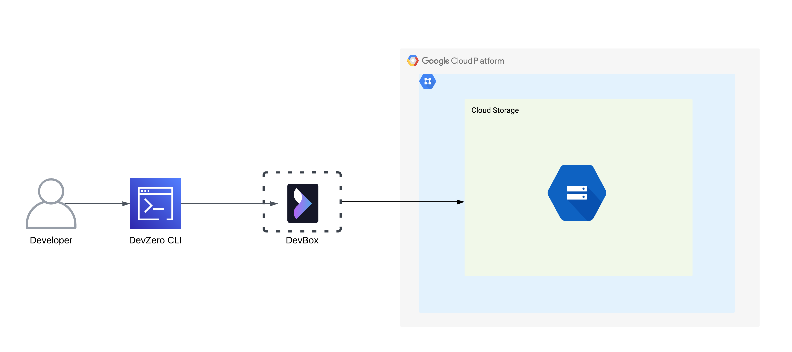
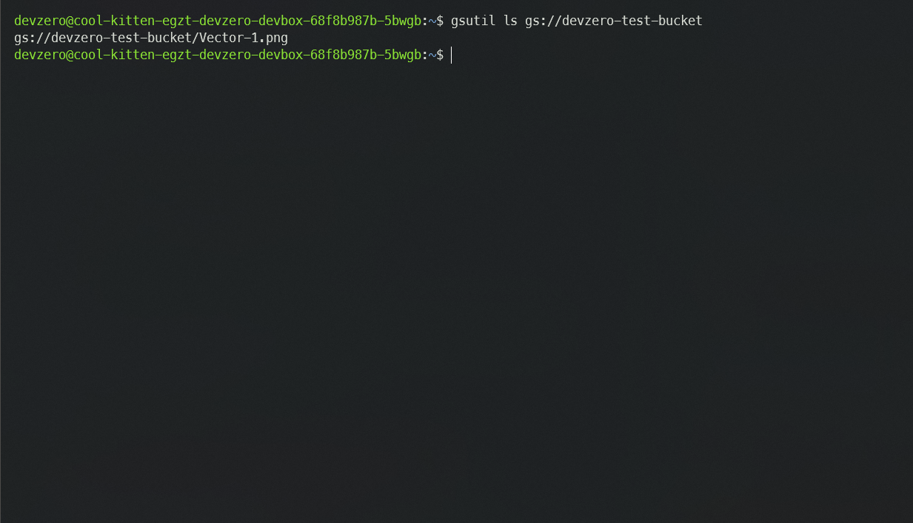
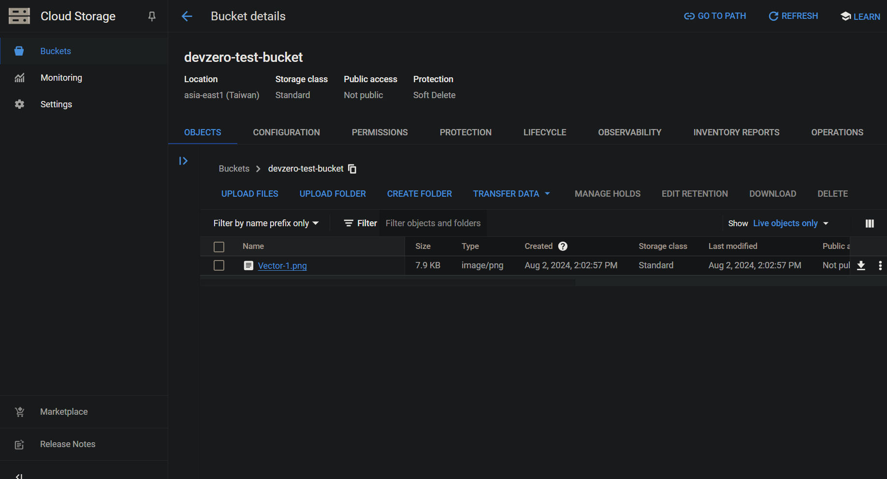

Connecting to GCP Cloud Storage Service from your DevBox.

## Architecture Diagram



## Existing Cloud Storage

### Connecting to GCP Cloud Storage

1. Go to your **DevBox** and install Gcloud SDK:

```
sudo apt-get update
sudo apt-get install apt-transport-https ca-certificates gnupg curl
sudo apt-get update && sudo apt-get install google-cloud-cli
```

2. Authenticate your GCP account with Gcloud SDK:

```
gcloud init
```

3. Access your cloud storage list by:

```
gsutil ls gs://<storage-name>
```



## New Cloud Storage Bucket

### Step 1: Creating a storage bucket

1. Go to **Cloud Storage > Buckets**.
2. Click on **Create**.
3. Enter a unique name for the bucket and click on **Create**.



### Step 2: Accessing the storage bucket from Devbox

1. Go to your **DevBox** and install Gcloud SDK:

```
sudo apt-get update
sudo apt-get install apt-transport-https ca-certificates gnupg curl
sudo apt-get update && sudo apt-get install google-cloud-cli
```

2. Authenticate your GCP account with Gcloud SDK:

```
gcloud init
```

3. Access your cloud storage list by:

```
gsutil ls gs://<storage-name>
```


