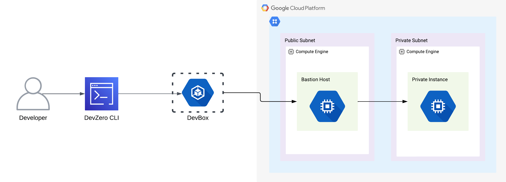

# GCP Compute Instance
Connecting to Compute Instance running in the private subnet of GCP VPC from your DevBox.

## Architecture Diagram:



## Prerequisites:

Follow [Connecting to GCP](../../existing-network/connecting-to-gcp.md) guide.

## Existing Compute Instance

### Step 1: Accessing Compute Instance from a DevBox

1. Go to **Compute Engine > VM Instances**.
2. Click on **SSH**. You will see the commands for accessing it.
3. Go to **DevBox** and make a copy of the key pair.
4. Connect to Compute Instance:


```
ssh -i "path/to/private/key" username@instance-ip
```



## New Compute Instance Virtual Machine

### Step 1: Creating an Compute Instance

1. Go to **Compute Engine > Create Instance**.
2. Enter the name of the instance along with region and machine type.
3. Use one of the [supported linux distros](https://console.cloud.google.com/compute/images).
4. Choose the **Instance type**.
5. Go to **Advanced Options > Networking > Network Tags** and enter the firewall tags.
6. Go to **Advanced Options > Networking > Network Interfaces**, click on **Network** and choose the VPC where your bastion host is running, then click on **Subnetwork** and choose the private subnet.
7. Copy the newly created SSH key pair once the instance is created.

### Step 2: Accessing Compute Instance from a DevBox
1. Go to the **DevBox** and make a copy of the key pair.
2. Connect to the desired Compute instance using ssh and the new key pair:


```
ssh -i "path/to/private/key" username@instance-ip
```



