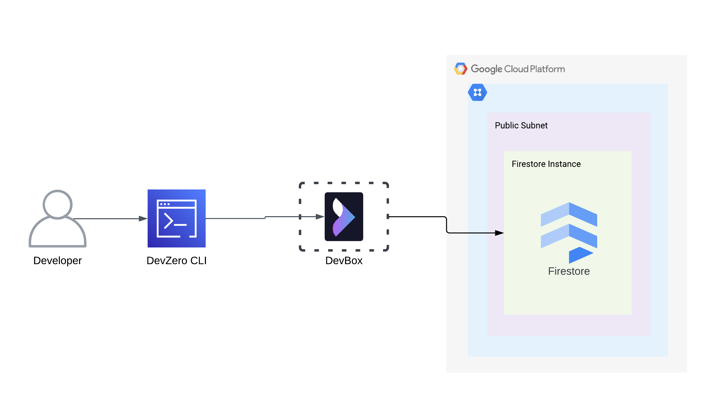
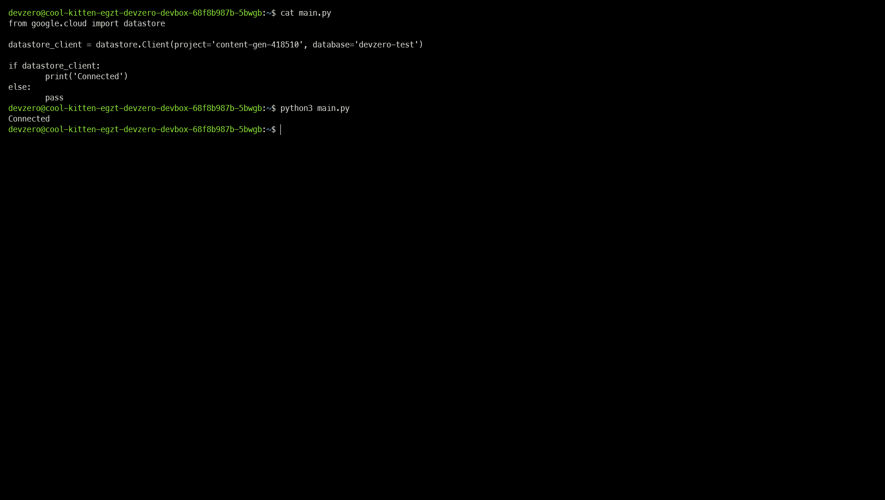
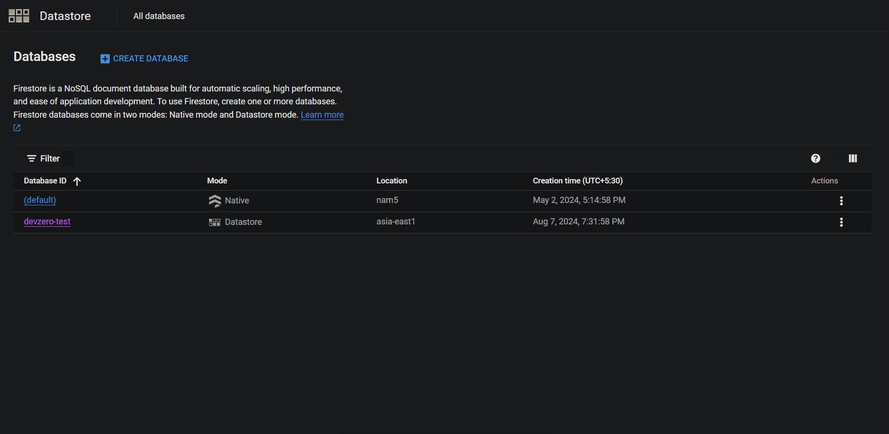

Connecting to an Firestore instance to your DevBox.

## Architecture Diagram



## Prerequisites

- Follow the [Connecting to GCP](../../existing-network/connecting-to-gcp.md) guide.

## Existing Database

### Step 1: Accessing GCP Firestore Instance from a DevBox

1. Connect to your DevZero workspace.
2. Store the **Google Authentication Credentials** on the workspace.
3. Install **Python** and **PIP**:

```
sudo apt update
sudo apt install python3 python3-dev python3-venv
sudo apt-get install wget
wget https://bootstrap.pypa.io/get-pip.py
```

4. Install **Firestore Admin API**:

```
pip install --upgrade google-cloud-datastore
```

5. Set the **GOOGLE_APPLICATION_CREDENTIALS** environment variable.

```
export GOOGLE_APPLICATION_CREDENTIALS=/path/to/the/key.json
```

6. Write a Python scipt to test the Firestore Admin API Connection:

```python
from google.cloud import datastore

datastore_client = datastore.Client(project='content-gen-418510', database='devzero-test')

if datastore_client:
    print('Connected')
else:
    pass
```

7. Run the Python Script:

```
python3 <file-name>.py
```

If the connection is successful, you should see **"Connected"** printed in the terminal output.



## New Database

### Step 1: Creating an Firestore Instance

1. Go to **Firestore > Databases** and click on **Create database**.
2. Choose the **Datastore Mode** and click on **Continue**.
3. Enter your **Database ID**  and select the between **Region** and **Multi-region** mode.
4. Choose your desired region and click on **Create Database**.



### Step 2: Accessing Firestore Database from DevBox

1. Connect to your DevZero workspace.
2. Store the **Google Authentication Credentials** on the workspace.
3. Install **Python** and **PIP**:

```
sudo apt update
sudo apt install python3 python3-dev python3-venv
sudo apt-get install wget
wget https://bootstrap.pypa.io/get-pip.py
```

4. Install **Firestore Admin API**:

```
pip install --upgrade google-cloud-datastore
```

5. Set the **GOOGLE_APPLICATION_CREDENTIALS** environment variable.

```
export GOOGLE_APPLICATION_CREDENTIALS=/path/to/the/key.json
```

6. Write a Python scipt to test the Firestore Admin API Connection:

```python
from google.cloud import datastore

datastore_client = datastore.Client(project='content-gen-418510', database='devzero-test')

if datastore_client:
    print('Connected')
else:
    pass
```

7. Run the Python Script:

```
python3 <file-name>.py
```

If the connection is successful, you should see **"Connected"** printed in the terminal output.


