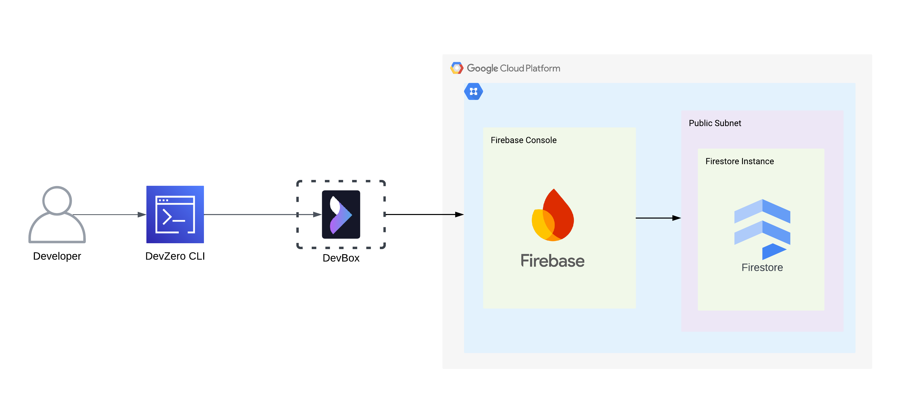

# GCP Firestore (Native Mode)

Connecting to an Firestore instance to your DevBox.

## Architecture Diagram



## Prerequisites

- Follow the [Connecting to GCP](../../existing-network/connecting-to-gcp.md) guide.

## Existing Database

### Step 1: Accessing GCP Firestore Instance from a DevBox

1. Connect to your DevZero workspace.
2. Store the **Google Authentication Credentials** on the workspace.
3. Install **Python** and **PIP**:


```
sudo apt update
sudo apt install python3 python3-dev python3-venv
sudo apt-get install wget
wget https://bootstrap.pypa.io/get-pip.py
```


4. Install **Firestore Admin API**:


```
pip install --upgrade firebase-admin
```


5. Set the **GOOGLE_APPLICATION_CREDENTIALS** environment variable.


```
export GOOGLE_APPLICATION_CREDENTIALS=/path/to/the/key.json
```


6. Write a Python scipt to test the Firestore Admin API Connection:


```python
import firebase_admin
from firebase_admin import credentials, firestore

db = firestore.Client(project='content-gen-418510', database='devzero-test')

if db:
    print('connected')
else:
    pass
```


7. Run the Python Script:


```
python3 <file-name>.py
```


If the connection is successful, you should see **"Connected"** printed in the terminal output.


## New Database

### Step 1: Creating an Firestore Instance

1. Go to **Firestore > Databases** and click on **Create database**.
2. Choose the **Native Mode** and click on **Continue**.
3. Enter your **Database ID**  and select the between **Region** and **Multi-region** mode.
4. Choose your desired region and click on **Create Database**.


### Step 2: Accessing Firestore Database from DevBox

1. Connect to your DevZero workspace.
2. Store the **Google Authentication Credentials** on the workspace.
3. Install **Python** and **PIP**:


```
sudo apt update
sudo apt install python3 python3-dev python3-venv
sudo apt-get install wget
wget https://bootstrap.pypa.io/get-pip.py
```


4. Install **Firestore Admin API**:


```
pip install --upgrade firebase-admin
```


5. Set the **GOOGLE_APPLICATION_CREDENTIALS** environment variable.


```
export GOOGLE_APPLICATION_CREDENTIALS=/path/to/the/key.json
```


6. Write a Python scipt to test the Firestore Admin API Connection:


```python
import firebase_admin
from firebase_admin import credentials, firestore

db = firestore.Client(project='content-gen-418510', database='devzero-test')

if db:
    print('connected')
else:
    pass
```


7. Run the Python Script:


```
python3 <file-name>.py
```


If the connection is successful, you should see **"Connected"** printed in the terminal output.


