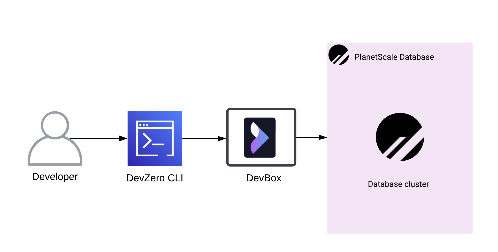
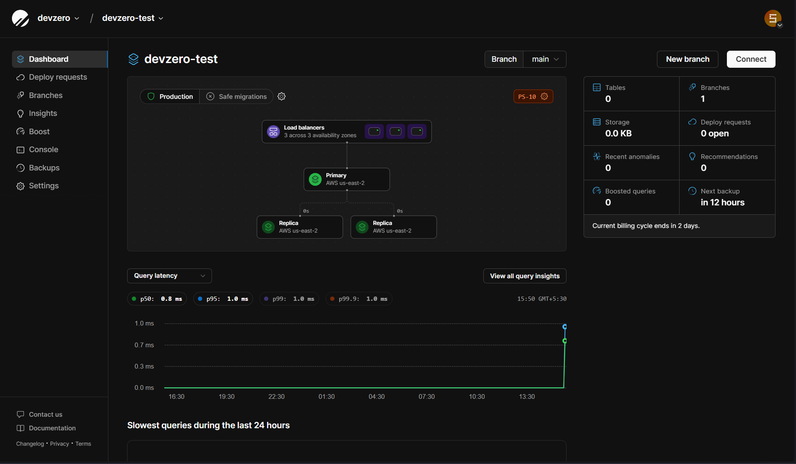

Comprehensive guide for connecting to a PlanetScale Database from your DevBox.

If you're more of a visual learner, check out the [video tutorial](#video-walkthrough)!

## Architecture Diagram



[PlanetScale](https://www.timescale.com/products) is a MySQL based database service which is built on Vitess and unlocks performance, scalability, and cost optimization for hyperscale databases through horizontal sharding. In this guide, we will walk you through the entire process of connecting your PlanetScale Database to your DevBox.

## Prerequisites

Before you begin, create your account with [PlanetScale](https://auth.planetscale.com).

## Existing PlanetScale Database

### Step 1: Generating connection string

Follow the below steps to generate the connection string for database:

1. Go to **[PlanetScale Dashboard](https://app.planetscale.com/)**.
2. Click on the database you want to access.
2. Click on  **Connect** and click on **Create password**.
3. Note down the **Username** and **Password** generated as it would not be displayed again.
4. In the **Select your language or framework** choose the language or framework you want to connect your database with. For this guide, we will be going with MySQL CLI.
5. Note down the connection string.

### Step 2: Creating the Recipe for Workspace

You will need to create a Recipe in DevZero equipped with the necessary tools like `mysql`:

1. Go to **DevZero** Dashboard and open the **Recipes** tab.
2. Click on New Recipe and enter the recipe's name.
3. Click on **Create a recipe**, and your recipe will be created.
4. Replace the recipe yaml file with the snippet below. Remember to replace the placeholder username and password with the value you noted down in the above steps:


```
version: "3"

build:
  steps:
    - type: apt-get
      packages: ["build-essential", "curl", "git", "nano", "software-properties-common", "ssh", "sudo", "tar", "unzip", "vim", "wget", "zip", "mysql-client"]

runtime:
    Environment:
    - name: DATABASE_USERNAME
      value: <username>
    - name: DATABASE_PASSWORD
      value: <password>
```



5. After editing the recipe, click on **Save and Build**.
6. When the build is successful, click on **Publish**.
7. After the recipe is published, click on **Launch** and create a new workspace by providing a **Workspace Name**.
8. Click on **Launch** and your workspace will be created.


### Step 3: Connecting to the Database

Now, with everything set, you just need to use the connection string to access the database:

1. Go to DevBox.
2. Use the following command to connect to the database:


```
mysql -h aws.connect.psdb.cloud -D <database-name> -u $DATABASE_USERNAME -p$DATABASE_PASSWORD --ssl-mode=VERIFY_IDENTITY --ssl-ca=/etc/ssl/certs/ca-certificates.crt

```



## New PlanetScale Workspace

If you need to make a new PlanetScale database and access it through DevBox, then follow the below steps:

### Step 1: Creating a PlanetScale Database

1. Go to **[PlanetScale Dashboard](https://app.planetscale.com/)**.
2. Click on **Create a new database** and enter the **Name** and **Region** of your database instance.
3. Then choose the **Cluster size** and **Autoscaling storage** and click on **Create database**.
4. Enter the **Password name** when prompted.
5. A **Username** and **Password** would be generated for you. Note down the password as it would not be displayed again.
6. In the **Select your language or framework** choose the language or framework you want to connect your database with. For this guide, we will be going with MySQL CLI.
7. Note down the connection string.



### Step 2: Creating the Recipe for Workspace

You will need to create a Recipe in DevZero equipped with the necessary tools like `mysql`:

1. Go to **DevZero** Dashboard and open the **Recipes** tab.
2. Click on New Recipe and enter the recipe's name.
3. Click on **Create a recipe**, and your recipe will be created.
4. Replace the recipe yaml file with the snippet below. Remember to replace the placeholder username and password with the value you noted down in the above steps:


```
version: "3"

build:
  steps:
    - type: apt-get
      packages: ["build-essential", "curl", "git", "nano", "software-properties-common", "ssh", "sudo", "tar", "unzip", "vim", "wget", "zip", "mysql-client"]

runtime:
    Environment:
    - name: DATABASE_USERNAME
      value: <username>
    - name: DATABASE_PASSWORD
      value: <password>
```



5. After editing the recipe, click on **Save and Build**.
6. When the build is successful, click on **Publish**.
7. After the recipe is published, click on **Launch** and create a new workspace by providing a **Workspace Name**.
8. Click on **Launch** and your workspace will be created.


### Step 3: Connecting to the Database

Now, with everything set, you just need to use the connection string to access the database:

1. Go to DevBox.
2. Use the following command to connect to the database:


```
mysql -h aws.connect.psdb.cloud -D <database-name> -u $DATABASE_USERNAME -p$DATABASE_PASSWORD --ssl-mode=VERIFY_IDENTITY --ssl-ca=/etc/ssl/certs/ca-certificates.crt

```



## Video Walkthrough

{% embed url="https://devzero.b-cdn.net/how%20to%20guide%20Planetscale%20Database.mov" %}
