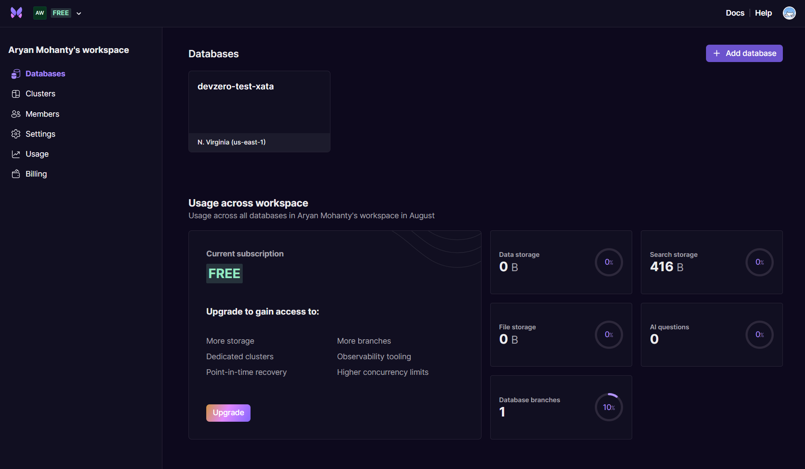

# Xata

Comprehensive guide for connecting to a Xata Project from your DevBox.

## Architecture Diagram


Here, you will connect to a Xata Workspace Database from your DevBox. This would be done by setting up the database in your Workspace dashboard and accessing it through `psql` client tool.

## Prerequisites

Before you begin, you should create your account with [Xata](https://app.xata.io/signin) and create a new Workspace.

## Existing Xata Project

For connecting to an existing Xata database, ensure that **direct access to Postgres** is enabled, otherwise create a new database with the said option enabled and import the data from the existing database.

### Step 1: Installing dependencies in DevBox

Now we need to install the Postgres `psql` client tool.

Follow the below steps to do so:

1. Use the following command to reload the local package database:


```bash
sudo apt-get update
```


2. Install the PostgresSQL :


```bash
sudo apt install postgresql-client
```



### Step 2: Connecting with the Project

To make the connection, follow the below steps:

1. Go to **[Xata Account Settings](https://app.xata.io/settings)**.
2. In the **Personal API keys** section, click on **Add a key** and enter the name of the key.
3. Copy the secret API key and export it to your DevBox Evironmental variables:


```
export XATA_API_KEY=<api-key>
```


4. Go to **[Xata Dashboard](https://app.xata.io/workspaces)**.
5. Open the database which you want to access through the DevBox.


6. Copy the connection  string for **PostgreSQL endpoint** and then use the following command to connect to the database:


```
psql postgresql://<workspace-id>:<YOUR_API_KEY>@<region>.sql.xata.sh/<database-name>:<branch>?sslmode=require
```



## New Xata Workspace

If you need to make a new Xata database and access it through DevBox, then follow the below steps:

### Step 1: Creating a Workspace Database

1. Go to **[Xata Dashboard](https://app.xata.io/workspaces)**.
2. If you havn't created any database then the dashbaord will automatically prompt you make a new database, but if you have completed the initial setup then you just need to click on **Add database**.
3. Enter the database **Name**, choose the **Region** and enable the **Enable direct access to Postgres** option.
4. Click on **Create** and your Database will be created and will show up on your dashboard.



### Step 2: Installing dependencies in DevBox

Now we need to install the Postgres `psql` client tool.

Follow the below steps to do so:

1. Use the following command to reload the local package database:


```bash
sudo apt-get update
```


2. Install the PostgresSQL :


```bash
sudo apt install postgresql-client
```



### Step 3: Connecting with the Project

To make the connection, follow the below steps:

1. Go to **[Xata Account Settings](https://app.xata.io/settings)**.
2. In the **Personal API keys** section, click on **Add a key** and enter the name of the key.
3. Copy the secret API key and export it to your DevBox Evironmental variables:


```
export XATA_API_KEY=<api-key>
```


4. Go to **[Xata Dashboard](https://app.xata.io/workspaces)**.
5. Open the database which you want to access through the DevBox.


6. Copy the connection  string for **PostgreSQL endpoint** and then use the following command to connect to the database:


```
psql postgresql://<workspace-id>:<YOUR_API_KEY>@<region>.sql.xata.sh/<database-name>:<branch>?sslmode=require
```


